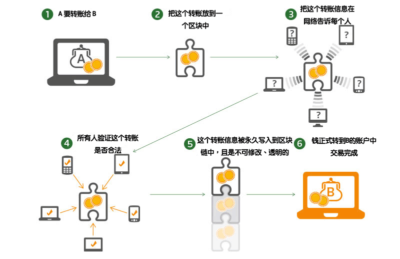

# 区块链入门

区块链是一个共享的、不可篡改的账本，旨在促进业务网络中的交易记录和资产跟踪流程。

## 关键元素

* 分布式账本技术
* 不可篡改记录
* 智能合同: 为了加快交易速度，区块链上存储了一系列自动执行的规则，称为 "智能合约"

## 区块链特性

* 去中心化: 分布式存储，不存在中心点
* 开放性: 数据公开透明，任何人都可以参与进来
* 自治性: 采用基于协商一致的规范和协议，各个节点按照这个规范来，由对“人”的信任改变为对机器的信任，没有人为干预
* 信息不可篡改: 信息存储到链上就永久保存无法改变(除非51%攻击，可能性很小)
* 匿名性: 链上没有个人信息，因为这些都是加密的

## 网络类型

建立区块链网络有多种方法。 区块链网络分为公有、私有、许可、或由联盟构建。

## 区块结构

区块包含两个部分：

* 区块头(Head): 记录当前区块的元数据
* 区块体(Body): 实际数据

包含数据如下图所示：

## 例子

