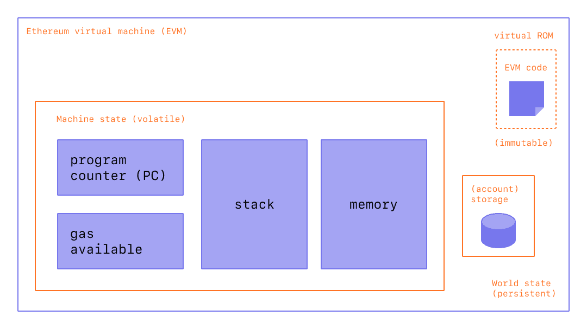

# 以太坊虚拟机(EVM)

[官方文档](https://docs.soliditylang.org/en/v0.8.15/introduction-to-smart-contracts.html#overview)([中文文档](https://learnblockchain.cn/docs/solidity/introduction-to-smart-contracts.html#id11))是这样描述的：

```
The Ethereum Virtual Machine or EVM is the runtime environment for smart contracts in Ethereum. It is not only sandboxed but actually completely isolated, which means that code running inside the EVM has no access to network, filesystem or other processes. Smart contracts even have limited access to other smart contracts.
以太坊虚拟机 EVM 是智能合约的运行环境。它不仅是沙盒封装的，而且是完全隔离的，也就是说在 EVM 中运行代码是无法访问网络、文件系统和其他进程的。甚至智能合约之间的访问也是受限的。
```

## EVM 基本模型

  

*图表来自 [Ethereum EVM illustrated](https://takenobu-hs.github.io/downloads/ethereum_evm_illustrated.pdf)*


EVM 的存储空间有三类，stack、memory、storage。(pc、code、args即calldata)

- storage 是永久性存储，采用256位字映射到256位的键值存储区。 在合约中枚举存储是不可能的，且读存储的相对开销很高，修改存储的开销甚至更高。合约只能读写存储区内属于自己的部分。
- stack 和 memory 都是临时存储，在智能合约运行时有效，当运行结束后回收。memory 主要是临时存储数组、字符串等较大的交易时的数据，可以在字节级读取，但读取限制为256位宽，而写操作可以是8位或256位宽。当访问（读取或写入）先前未访问过的存储器字(字内的任何偏移)时，存储器会按字(256位)进行扩展。扩容会消耗一定的Gas。
- EVM 作为一个堆栈机运行，其栈的深度为 1024 个项。 每个项都是 256 位字(32字节)，为了便于使用，选择了 256 位加密技术（如 Keccak-256 哈希或 secp256k1 签名）。**对栈的访问并不是完全严格按照 FILI（先进后出），而是一种寄存器栈，允许将顶端的16个元素中的某一个复制或者交换到栈顶**。每次操作只能取栈顶的若干元素，把结果压栈。当然也能够把栈顶元素放到 storage 或者 memory 区域保存。
- EVM有属于它自己的语言：EVM字节码，在以太坊上运行的智能合约时，通常都是用高级语言例如Solidity来编写代码，然后将它编译成EVM可以理解的EVM字节码。

## ETH的状态共识的关键

1.新的区块将以上个区块最新的的状态树为基础，执行自己区块内所有交易，并且不断修改state tree，在所有交易执行完成后会生成新的state tree,这个新的状态树的tree root会被打包进区块，参与区块共识流程

2.不同节点执行同一笔交易可以得出相同的结果


## 以太坊状态树

### Merkle树
Merkle树又称为哈希树，是一种二叉树，由一个根节点、若干中间节点和一组叶节点组成。最底层的叶节点包含存储数据，在它之上的一层节点为它们对应的Hash值，中间节点是它下面两个子节点内容的Hash值，根节点是最后顶层的Hash值，一般称为Merkle根。Merkle树的层层Hash计算，任何底层叶节点或者说某个节点的数据变动都会传递到其父亲节点，并直达树根。当叶子节点发生数据改变时，如果要比较两个集合的数据是否相同，则只需要比较两次数据的树根即可，若底层叶节点数据相同，则树根相同；反之，树根便不相同。因此Merkle树的典型应用场景具体如下：
快速比较大量数据：当两个Merkle树根相同时，则意味着所代表的数据必然相同。
快速定位变更：可以快速定位到发生改变的路径。

### MPT（Merkle Patricia Trie）状态树
Trie树是一种有序的树型结构，也被称作前缀树或字典树，一般用于保存关联数组，其中的键通常是字符串，键不保存在节点中，而是由节点在树中的位置决定，根节点对应空字符串，键对应的值标注在节点之下。
Patricia树是一种节省空间的压缩前缀树。相对于Trie树存在的缺点，每个前置节点仅能表示一个字母，不管key和其他key有没有共享内容，key越长，树的深度也越长。Patricia树的主要改进在于如果存在一个父节点只有一个子节点，那么这个父节点将与其子节点合并，这样可以减小Trie中树的深度，加快搜索节点速度，同时也减少了空间的消耗。
MPT就是Merkle和Patricia结合后的产物，在以太坊中，MPT包含4种不同的节点：空节点、叶子节点、扩展节点和分支节点。
空节点：无实际内容节点，但占用一个元数据存储。
叶子节点（leaf）：是一个键值对（key，value），其中key是原始内容的一种特殊十六进制编码，value是内容的RLP编码。
扩展节点（extension）：也是一个键值对（key，value），但是value是其他节点的Hash值，即指向其他节点的链接。
分支节点（branch）：由于key被编码成一种特殊的十六进制的表示，还有最后的value，所以分支节点是一个长度为17的列表，前16个元素对应着key中的16个可能的十六进制字符，如果有一个（key,value）键值对在这个分支节点终止，那么最后一个元素代表一个值，即分支节点既可以是搜索路径的终止也可以是搜索路径的中间节点。分支节点的父节点基本上就是扩展节点。

MPT数据和验证广泛应用于以太坊中，在区块结构中包含区块头header，header里面包含3种类型的树根：


1. 状态树stateRoot：状态树是全局的树。
* path = sha3（ethereumAddress）：以太坊账户地址。
* value = rlp（[nonce, balance, storageRoot, codeHash]）：交易次数、账户余额、存储树、合约代码 Hash。
其中 storageRoot 是另一个 trie 树，用于存储合约的所有数据，每个账户都有一个独立的storageRoot 树。
2. 交易树transactionsRoot：每个 block 都有一个交易树。
* path = rlp（transactionIndex）：该交易在 block 中的索引，顺序由矿工决定。
* value = 交易记录。
该树生成后永远不会被修改。
3. 收据树receiptsRoot：每个block都有一个收据树。
* path = rlp（receiptIndex）：该交易在 block 中生成 receipt 的索引，顺序由矿工决定。
* value = receipt 记录。
该树生成后永远不会被修改。


## 以太坊账户

以太坊的账户分为普通账户和合约账户


## 以太坊交易

nonce: 由始发EOA（外部所有账户）发出的序列号，用于防止消息重播。
gas price: 发起人愿意支付的gas价格（以wei为单位）。
start gas: 发起人愿意支付的最大gas量。
to: 目标以太坊地址。
value: 发送到目标地址的ether数量。
data: 变长二进制数据。
v,r,s: 始发EOA的ECDSA签名的三个组成部分。


### 交易执行过程
入口函数位于core/state_processor.go中的process()方法里的ApplyTransaction()函数，该函数会真正执行以太坊的每一个交易
	新建 EVMContext
	首先生成 StateTransition 对象, 然后调用其 TransitionDb 方法开始交由 EVM虚拟机 执行该交易
		检查交易是否满足规则
			消息调用者的 nonce 正确
			调用者有足够的余额来支付交易费用(gaslimit * gasprice)
			所需的 gas 量在区块中可用
			支付的 gas 足以覆盖固有成本
			计算固有成本的 gas 时没有溢出
			调用者有足够的余额来支付最顶层调用的资产转移
		计算剩余可用gas
		判断合约类型, 然后根据类型调用 EVM 执行：创建合约或者调用合约
			创建合约（core/vm/evm.go#Create）
			合约调用（core/vm/evm.go#Call）
		将未使用完的gas退还到发起者账户中
		向矿工账户支付手续费
	更新世界树状态
	为执行成功的交易生成交易收据

## 代码结构

- core/
  - state_process.go EVM入口函数
  - state_Transaction.go 调用EVM前的准备
- core/vm/
  - analysis.go 实现了合约代码扫描检测的工具函数
  - common.go 实现了一些公用的辅助函数
  - contract.go 实现了**contract 这个重要的结构及其方法**
  - contracts.go 实现了主要预编译合约
  - evm.go 实现了**evm虚拟机的结构定义和相关的重要方法**
  - gas_table.go 实现了各类不同指令所需要的**动态计算gas的方法**
  - instructions.go 实现了各类指令的实际执行代码。
  - interface.go 定义了StatDB 接口和 Callcontext 接口
  - interpreter.go 实现了Opcode解释器。Opcode的**解释执行都在这里**
  - intpool.go 大整数的缓冲池，主要是为了优化速度，避免重复计算。
  - jump_table.go **非常重要的lookup table**，针对每一个具体的opCode， 分别指向了gas_table，和instructions中的具体实现。解释器直接会根据opCode来进行查找。
  - memory.go 实现了EVM中的临时memory存储。
  - opcodes.go 定义了所有的opCode以及其和字符串的映射表
  - stack.go EVM中所用到的栈的实现。
- params/
  - protocol_params 定义了各个不**同代际的EVM各类操作的Gas费用标准**


## EVM 原理

通常智能合约的开发流程是使用 solidity 编写逻辑代码，通过编译器编译成 bytecode，然后发布到以太坊上，以太坊底层通过 EVM 模块支持合约的执行和调用，调用时根据合约地址获取到代码，即合约的字节码，生成环境后载入到 EVM 执行。大致流程如下图，从 EVM code 中不断取出指令执行，利用 Gas 来实现限制循环，利用栈来进行操作，内存存储临时变量，账户状态中的 storage 用来存储数据。


### EVM执行过程
#### 创建合约
流程：
1. 判断调用深度是否超过最大限制1024
2. 判断调用发起者地址是否有充足的余额进行转账操作
3. 调用发起者地址 nonce + 1, 表示调用发起者地址已经完成一次交易
4. 检测所创建的合约地址是否唯一
5. 创建快照, 用于回滚
6. 在 Trie 对象中使用该地址创建对应的合约账户, 并且 nonce 初始值设为1表示初始化了
7. 把调用发起者转账的额度发送到这个合约地址
8. 生成 Contract, 同时设置 Contract 的关键属性, caller: 调用者, address:合约地址, value:调用者在创建合约的同时向合约账户转账 value 数量的 eth, gas:当前 gas 剩余量, Code, CodeHash, CodeAddr
9. 调用解释器运行部署代码+构造函数, 并返回合约的主体代码（core/vm/interpreter.go#Run）
10. 检查代码大小是否超过了最大限制24576
11. 计算存储代码消耗的gas，扣除并向 Trie 对象中存储合约的代码，以供后续的交易调用该合约
12. 如果过程中发证错误，回滚 Trie 对象和 gas 计费相关的修改
#### 合约调用
1. 判断调用深度是否超过最大限制1024
2. 判断调用发起者地址是否有充足的余额进行转账操作
3. 创建快照, 用于回滚
4. 判断地址是否存在
5. 进行转账
6. 调用的合约如果是预设的内置合约，直接执行
7. 如果不是预设的内置合约，根据调用合约的地址 从Trie对象中获取代码
8. 生成 Contract, 同时设置 Contract 的关键属性
9. 调用解释器运行代码（core/vm/interpreter.go#Run）
10. 如果过程中发证错误，回滚
#### 指令执行
1. 调用深度+1
2. 解释器循环运行, 直到执行出现以下情况时停止:遇到显式 STOP、RETURN 或 SE; 执行其中一个操作期间发生错误; 父上下文设置了 done 标志
   1. pc 一次取一个字节(两个16进制字符), 对应到跳转表中的操作
   2. 以太坊命令执行规定了最大和最小堆栈数量, 验证堆栈
   3. 扣除固定gas成本
   4. 如果有动态gas成本，进行扣减，并执行对应操作准备工作（如申请内存使用等）
   5. 执行指令具体操作
   6. pc+1读取下一条指令
3. 执行结束，stack放回stackPool
4. 调用深度-1

## gas 计算

  *图表来自 [Ethereum EVM illustrated](https://takenobu-hs.github.io/downloads/ethereum_evm_illustrated.pdf)*


## [EVM 操作码](https://www.ethervm.io/)

EVM通过一组指令来执行特定任务，这组指令被称为操作码，每个操作码只占一个字节，因此目前的操作码如下：


每个数字都是十六进制表示，蓝色标出的为正在使用的操作码，灰色横杠表示未被使用。每个操作码的作用都是将栈顶元素出栈，然后将结果入栈。

操作码主要分为以下：

- 栈操作相关的字节码（POP, PUSH, DUP, SWAP）
- 运算/比较/位操作相关的字节码（ADD， SUB， GT, LT, AND, OR）
- 环境相关的字节码（CALLER, CALLERVALUE， NUMBER）
- 内存操作字节码（MLOAD, MSTORE, MSTORE8, MSIZE）
- 存储操作字节码（SLOAD, SSTORE）
- 程序计数器相关的字节码（JUMP, JUMPI, PC, JUMPDEST）
- 终止相关的字节码（STOP， RETURN, REVERT, INVALID, SELFDESTRUCT）

## 指令集

jump_table.go定义了十种指令集合，每个集合实质上是个256长度的数组，对应了EVM的发展阶段。指令集向前兼容。

```go
// 边境、家园、橘口哨、伪龙、拜占庭、君士坦丁堡、伊斯坦布尔、柏林、伦敦、大合并
frontierInstructionSet         = newFrontierInstructionSet()
homesteadInstructionSet        = newHomesteadInstructionSet()
tangerineWhistleInstructionSet = newTangerineWhistleInstructionSet()
spuriousDragonInstructionSet   = newSpuriousDragonInstructionSet()
byzantiumInstructionSet        = newByzantiumInstructionSet()
constantinopleInstructionSet   = newConstantinopleInstructionSet()
istanbulInstructionSet         = newIstanbulInstructionSet()
berlinInstructionSet           = newBerlinInstructionSet()
londonInstructionSet           = newLondonInstructionSet()
mergeInstructionSet            = newMergeInstructionSet()
```


## EVM 结构


```go
// BlockContext provides the EVM with auxiliary information. Once provided
// it shouldn't be modified.
type BlockContext struct {
	// CanTransfer returns whether the account contains
	// sufficient ether to transfer the value
    // 返回账户是否包含足够的用来传输的以太币
	CanTransfer CanTransferFunc
	// Transfer transfers ether from one account to the other
    // 将以太从一个帐户转移到另一个帐户
	Transfer TransferFunc
	// GetHash returns the hash corresponding to n
	GetHash GetHashFunc

	// Block information
    // 区块相关信息
	Coinbase    common.Address // Provides information for COINBASE
	GasLimit    uint64         // Provides information for GASLIMIT
	BlockNumber *big.Int       // Provides information for NUMBER
	Time        *big.Int       // Provides information for TIME
	Difficulty  *big.Int       // Provides information for DIFFICULTY
	BaseFee     *big.Int       // Provides information for BASEFEE
	Random      *common.Hash   // Provides information for RANDOM
}

// TxContext provides the EVM with information about a transaction.
// All fields can change between transactions.
type TxContext struct {
	// Message information
    // 消息相关信息
	Origin   common.Address // Provides information for ORIGIN
	GasPrice *big.Int       // Provides information for GASPRICE
}

// EVM is the Ethereum Virtual Machine base object and provides
// the necessary tools to run a contract on the given state with
// the provided context. It should be noted that any error
// generated through any of the calls should be considered a
// revert-state-and-consume-all-gas operation, no checks on
// specific errors should ever be performed. The interpreter makes
// sure that any errors generated are to be considered faulty code.
//
// The EVM should never be reused and is not thread safe.
type EVM struct {
	// Context provides auxiliary blockchain related information
	// 辅助信息对象
	Context BlockContext
	TxContext
	// StateDB gives access to the underlying state
	// 为EVM提供StateDB相关操作
	StateDB StateDB
	// Depth is the current call stack
	// 当前调用的栈
	depth int

	// chainConfig contains information about the current chain
	// 链配置信息
	chainConfig *params.ChainConfig
	// chain rules contains the chain rules for the current epoch
	// 链规则
	chainRules params.Rules
	// virtual machine configuration options used to initialise the
	// evm.
	// 虚拟机配置
	Config Config
	// global (to this context) ethereum virtual machine
	// used throughout the execution of the tx.
	// 指令解释器
	interpreter *EVMInterpreter
	// abort is used to abort the EVM calling operations
	// NOTE: must be set atomically
	// 用于终止 EVM 调用操作
	abort int32
	// callGasTemp holds the gas available for the current call. This is needed because the
	// available gas is calculated in gasCall* according to the 63/64 rule and later
	// applied in opCall*.
	// 当前 call 可用的 gas
	callGasTemp uint64
}

// NewEVM returns a new EVM. The returned EVM is not thread safe and should
// only ever be used *once*.
func NewEVM(blockCtx BlockContext, txCtx TxContext, statedb StateDB, chainConfig *params.ChainConfig, config Config) *EVM {
	evm := &EVM{
		Context:     blockCtx,
		TxContext:   txCtx,
		StateDB:     statedb,
		Config:      config,
		chainConfig: chainConfig,
		chainRules:  chainConfig.Rules(blockCtx.BlockNumber, blockCtx.Random != nil),
	}
	evm.interpreter = NewEVMInterpreter(evm, config)
	return evm
}
```

**Contract 结构**

```go
// Contract represents an ethereum contract in the state database. It contains
// the contract code, calling arguments. Contract implements ContractRef
// 数据库中的以太坊智能合约，包括合约代码和调用参数
type Contract struct {
	// CallerAddress is the result of the caller which initialised this
	// contract. However when the "call method" is delegated this value
	// needs to be initialised to that of the caller's caller.
	// 合约调用者
	CallerAddress common.Address
	caller        ContractRef
	self          ContractRef

	// JUMPDEST分析的结果
	jumpdests map[common.Hash]bitvec // Aggregated result of JUMPDEST analysis.
	analysis  bitvec                 // Locally cached result of JUMPDEST analysis

	// 合约代码
	Code     []byte
	CodeHash common.Hash
	// 合约地址
	CodeAddr *common.Address
	Input    []byte

	Gas   uint64
	value *big.Int
}
```


Call、CallCode、DelegateCall这三者的主要区别就是这一点，主要就是在contract结构中的callerAddress、caller和self这三个的值不同。
如果外部账户A的某个操作通过Call方法调用B合约，而B合约又通过Call方法调用了C合约，那么最后实际上修改的是合约C账户的值；
如果外部账户A的某个操作通过Call方法调用B合约，而B合约通过CallCode方法调用了C合约，那么B只是调用了C中的函数代码，而最终改变的还是合约B账户的值。
DelegateCall其实跟CallCode方法的目的类似，都是只调用指定地址（合约C）的代码，而操作B的值。只不过它明确了CallerAddress是来自A，而不是B。所以这两种方法都可以用来实现动态库：即你调用我的函数和方法改动的都是你自己的数据）。
