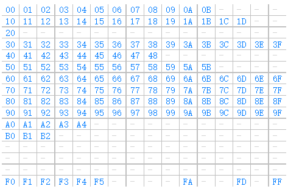

# 以太坊虚拟机(EVM)

[官方文档](https://docs.soliditylang.org/en/v0.8.15/introduction-to-smart-contracts.html#overview)([中文文档](https://learnblockchain.cn/docs/solidity/introduction-to-smart-contracts.html#id11))是这样描述的：

```
The Ethereum Virtual Machine or EVM is the runtime environment for smart contracts in Ethereum. It is not only sandboxed but actually completely isolated, which means that code running inside the EVM has no access to network, filesystem or other processes. Smart contracts even have limited access to other smart contracts.
以太坊虚拟机 EVM 是智能合约的运行环境。它不仅是沙盒封装的，而且是完全隔离的，也就是说在 EVM 中运行代码是无法访问网络、文件系统和其他进程的。甚至智能合约之间的访问也是受限的。
```

## EVM 基本模型

  

*图表来自 [Ethereum EVM illustrated](https://takenobu-hs.github.io/downloads/ethereum_evm_illustrated.pdf)*


EVM 的存储空间有三类，stack、memory、storage。(pc、code、args即calldata)

- storage 是永久性存储，采用256位字映射到256位的键值存储区。 在合约中枚举存储是不可能的，且读存储的相对开销很高，修改存储的开销甚至更高。合约只能读写存储区内属于自己的部分。
- stack 和 memory 都是临时存储，在智能合约运行时有效，当运行结束后回收。memory 主要是临时存储数组、字符串等较大的交易时的数据，可以在字节级读取，但读取限制为256位宽，而写操作可以是8位或256位宽。当访问（读取或写入）先前未访问过的存储器字(字内的任何偏移)时，存储器会按字(256位)进行扩展。扩容会消耗一定的Gas。
- EVM 作为一个堆栈机运行，其栈的深度为 1024 个项。 每个项都是 256 位字(32字节)，为了便于使用，选择了 256 位加密技术（如 Keccak-256 哈希或 secp256k1 签名）。**对栈的访问并不是完全严格按照 FILI（先进后出），而是一种寄存器栈，允许将顶端的16个元素中的某一个复制或者交换到栈顶**。每次操作只能取栈顶的若干元素，把结果压栈。当然也能够把栈顶元素放到 storage 或者 memory 区域保存。
- EVM有属于它自己的语言：EVM字节码，在以太坊上运行的智能合约时，通常都是用高级语言例如Solidity来编写代码，然后将它编译成EVM可以理解的EVM字节码。

## ETH的状态共识的关键

1.新的区块将以上个区块最新的的状态树为基础，执行自己区块内所有交易，并且不断修改state tree，在所有交易执行完成后会生成新的state tree,这个新的状态树的tree root会被打包进区块，参与区块共识流程

2.不同节点执行同一笔交易可以得出相同的结果


## 以太坊状态树


## 以太坊账户

以太坊的账户分为普通账户和合约账户


## 以太坊交易


## 代码结构

- core/
  - state_process.go EVM入口函数
  - state_Transaction.go 调用EVM前的准备
- core/vm/
  - analysis.go 实现了合约代码扫描检测的工具函数
  - common.go 实现了一些公用的辅助函数
  - contract.go 实现了**contract 这个重要的结构及其方法**
  - contracts.go 实现了主要预编译合约
  - evm.go 实现了**evm虚拟机的结构定义和相关的重要方法**
  - gas_table.go 实现了各类不同指令所需要的**动态计算gas的方法**
  - instructions.go 实现了各类指令的实际执行代码。
  - interface.go 定义了StatDB 接口和 Callcontext 接口
  - interpreter.go 实现了Opcode解释器。Opcode的**解释执行都在这里**
  - intpool.go 大整数的缓冲池，主要是为了优化速度，避免重复计算。
  - jump_table.go **非常重要的lookup table**，针对每一个具体的opCode， 分别指向了gas_table，和instructions中的具体实现。解释器直接会根据opCode来进行查找。
  - memory.go 实现了EVM中的临时memory存储。
  - opcodes.go 定义了所有的opCode以及其和字符串的映射表
  - stack.go EVM中所用到的栈的实现。
- params/
  - protocol_params 定义了各个不**同代际的EVM各类操作的Gas费用标准**


## EVM 原理

通常智能合约的开发流程是使用 solidity 编写逻辑代码，通过编译器编译成 bytecode，然后发布到以太坊上，以太坊底层通过 EVM 模块支持合约的执行和调用，调用时根据合约地址获取到代码，即合约的字节码，生成环境后载入到 EVM 执行。大致流程如下图，从 EVM code 中不断取出指令执行，利用 Gas 来实现限制循环，利用栈来进行操作，内存存储临时变量，账户状态中的 storage 用来存储数据。


## gas 计算

  *图表来自 [Ethereum EVM illustrated](https://takenobu-hs.github.io/downloads/ethereum_evm_illustrated.pdf)*


## [EVM 操作码](https://www.ethervm.io/)

EVM通过一组指令来执行特定任务，这组指令被称为操作码，每个操作码只占一个字节，因此目前的操作码如下：



每个数字都是十六进制表示，蓝色标出的为正在使用的操作码，灰色横杠表示未被使用。每个操作码的作用都是将栈顶元素出栈，然后将结果入栈。

操作码主要分为以下：

- 栈操作相关的字节码（POP, PUSH, DUP, SWAP）
- 运算/比较/位操作相关的字节码（ADD， SUB， GT, LT, AND, OR）
- 环境相关的字节码（CALLER, CALLERVALUE， NUMBER）
- 内存操作字节码（MLOAD, MSTORE, MSTORE8, MSIZE）
- 存储操作字节码（SLOAD, SSTORE）
- 程序计数器相关的字节码（JUMP, JUMPI, PC, JUMPDEST）
- 终止相关的字节码（STOP， RETURN, REVERT, INVALID, SELFDESTRUCT）

## 指令集

jump_table.go定义了十种指令集合，每个集合实质上是个256长度的数组，对应了EVM的发展阶段。指令集向前兼容。

```go
// 边境、家园、橘口哨、伪龙、拜占庭、君士坦丁堡、伊斯坦布尔、柏林、伦敦、大合并
frontierInstructionSet         = newFrontierInstructionSet()
homesteadInstructionSet        = newHomesteadInstructionSet()
tangerineWhistleInstructionSet = newTangerineWhistleInstructionSet()
spuriousDragonInstructionSet   = newSpuriousDragonInstructionSet()
byzantiumInstructionSet        = newByzantiumInstructionSet()
constantinopleInstructionSet   = newConstantinopleInstructionSet()
istanbulInstructionSet         = newIstanbulInstructionSet()
berlinInstructionSet           = newBerlinInstructionSet()
londonInstructionSet           = newLondonInstructionSet()
mergeInstructionSet            = newMergeInstructionSet()
```


## EVM 结构


```go
// BlockContext provides the EVM with auxiliary information. Once provided
// it shouldn't be modified.
type BlockContext struct {
	// CanTransfer returns whether the account contains
	// sufficient ether to transfer the value
    // 返回账户是否包含足够的用来传输的以太币
	CanTransfer CanTransferFunc
	// Transfer transfers ether from one account to the other
    // 将以太从一个帐户转移到另一个帐户
	Transfer TransferFunc
	// GetHash returns the hash corresponding to n
	GetHash GetHashFunc

	// Block information
    // 区块相关信息
	Coinbase    common.Address // Provides information for COINBASE
	GasLimit    uint64         // Provides information for GASLIMIT
	BlockNumber *big.Int       // Provides information for NUMBER
	Time        *big.Int       // Provides information for TIME
	Difficulty  *big.Int       // Provides information for DIFFICULTY
	BaseFee     *big.Int       // Provides information for BASEFEE
	Random      *common.Hash   // Provides information for RANDOM
}

// TxContext provides the EVM with information about a transaction.
// All fields can change between transactions.
type TxContext struct {
	// Message information
    // 消息相关信息
	Origin   common.Address // Provides information for ORIGIN
	GasPrice *big.Int       // Provides information for GASPRICE
}

// EVM is the Ethereum Virtual Machine base object and provides
// the necessary tools to run a contract on the given state with
// the provided context. It should be noted that any error
// generated through any of the calls should be considered a
// revert-state-and-consume-all-gas operation, no checks on
// specific errors should ever be performed. The interpreter makes
// sure that any errors generated are to be considered faulty code.
//
// The EVM should never be reused and is not thread safe.
type EVM struct {
	// Context provides auxiliary blockchain related information
	// 辅助信息对象
	Context BlockContext
	TxContext
	// StateDB gives access to the underlying state
	// 为EVM提供StateDB相关操作
	StateDB StateDB
	// Depth is the current call stack
	// 当前调用的栈
	depth int

	// chainConfig contains information about the current chain
	// 链配置信息
	chainConfig *params.ChainConfig
	// chain rules contains the chain rules for the current epoch
	// 链规则
	chainRules params.Rules
	// virtual machine configuration options used to initialise the
	// evm.
	// 虚拟机配置
	Config Config
	// global (to this context) ethereum virtual machine
	// used throughout the execution of the tx.
	// 指令解释器
	interpreter *EVMInterpreter
	// abort is used to abort the EVM calling operations
	// NOTE: must be set atomically
	// 用于终止 EVM 调用操作
	abort int32
	// callGasTemp holds the gas available for the current call. This is needed because the
	// available gas is calculated in gasCall* according to the 63/64 rule and later
	// applied in opCall*.
	// 当前 call 可用的 gas
	callGasTemp uint64
}

// NewEVM returns a new EVM. The returned EVM is not thread safe and should
// only ever be used *once*.
func NewEVM(blockCtx BlockContext, txCtx TxContext, statedb StateDB, chainConfig *params.ChainConfig, config Config) *EVM {
	evm := &EVM{
		Context:     blockCtx,
		TxContext:   txCtx,
		StateDB:     statedb,
		Config:      config,
		chainConfig: chainConfig,
		chainRules:  chainConfig.Rules(blockCtx.BlockNumber, blockCtx.Random != nil),
	}
	evm.interpreter = NewEVMInterpreter(evm, config)
	return evm
}
```

**Contract 结构**

```go
// Contract represents an ethereum contract in the state database. It contains
// the contract code, calling arguments. Contract implements ContractRef
// 数据库中的以太坊智能合约，包括合约代码和调用参数
type Contract struct {
	// CallerAddress is the result of the caller which initialised this
	// contract. However when the "call method" is delegated this value
	// needs to be initialised to that of the caller's caller.
	// 合约调用者
	CallerAddress common.Address
	caller        ContractRef
	self          ContractRef

	// JUMPDEST分析的结果
	jumpdests map[common.Hash]bitvec // Aggregated result of JUMPDEST analysis.
	analysis  bitvec                 // Locally cached result of JUMPDEST analysis

	// 合约代码
	Code     []byte
	CodeHash common.Hash
	// 合约地址
	CodeAddr *common.Address
	Input    []byte

	Gas   uint64
	value *big.Int
}
```
