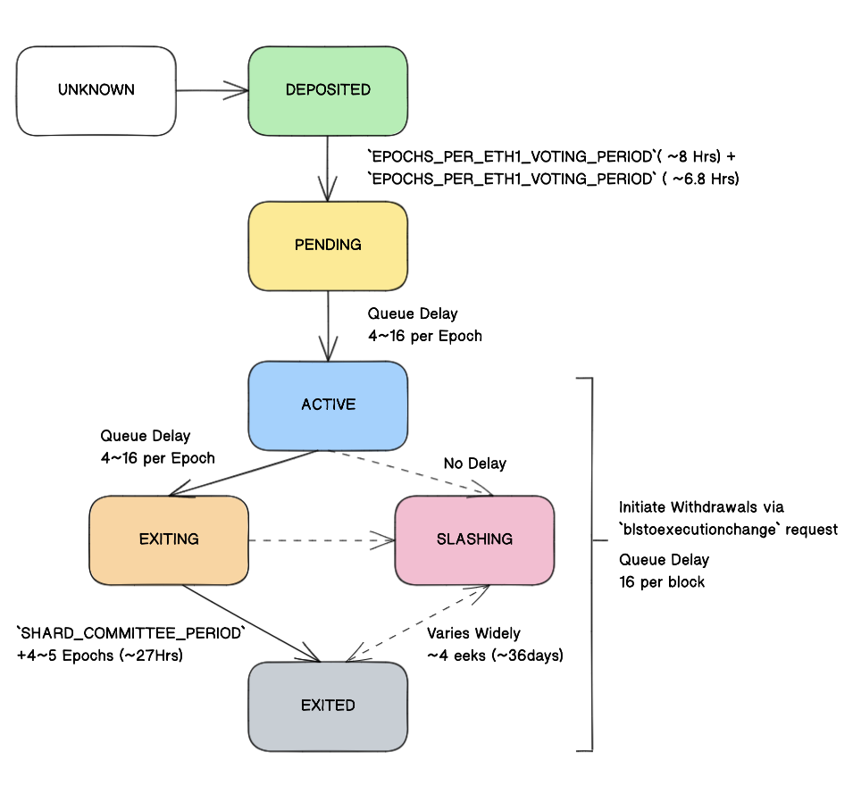

# 以太坊信标链

信标链是 2020 年启动的第一条权益证明区块链的名称。它的创立是为了在以太坊主网上运行权益证明共识逻辑之前确保该逻辑是可靠且可持续的。要停止以太坊的工作量证明机制并启动权益证明机制，需要让信标链接受来自原有以太坊链上的交易，把交易打包进区块，随后再将区块组织到一条运行权益证明共识机制的区块链上。与此同时，原有的以太坊客户端停止挖矿、区块传播及旧的共识逻辑，并将这一切转交给信标链。此事件称为合并。

## 作用

**信标链是帐户账本的名称，在质押人开始验证真实的以太坊交易之前管理和协调以太坊质押人网络，它不处理交易或智能合约间的交互。**信标链引入共识层，取代了以太坊在工作量证明机制下的挖矿，并带来了很多重大改进。信标链是实现以太坊安全、环保、可扩展的基础组成部分。

## 影响

### 质押

信标链将权益证明机制引入以太坊，这保证了以太坊的安全，并在此过程中让验证者赢得了更多以太币。在实践中，质押涉及将以太币质押以激活验证者软件。作为质押人，运行该软件并在链中创建和验证新区块。
质押的作用与曾经的挖矿类似，但在许多地方有所不同。挖矿的前期支出庞大，需要投入强大的硬件和消耗大量能源，从而产生规模经济并促进集中化。挖矿也没有任何将资产锁定为抵押品的要求，这限制了协议在被攻击后惩罚不良行为者的能力。和工作量证明相比，过渡到权益证明让以太坊的安全性与去中心化得到显著提升。参与该网络的人越多，网络就会变得越去中心化，面临攻击时也越安全。

### 设置分片

在信标链与最初的以太坊主网合并后，以太坊社区开始寻求扩展该网络。
权益证明的优势是拥有任何给定时间已批准区块生产者的记录，每个区块生产者质押了以太币。这个记录不但为分开治理奠定了基础，还可靠地划分了具体的网络责任。这种责任与工作量证明形成对比，在工作量证明中，矿工对网络没有义务，可以立即停止挖矿并永久关闭其节点而不会受到任何影响。也没有已知区块提议者的记录，并且没有可靠的方法安全地划分网络责任。

## 分片和信标链

只有在权益证明共识机制到位的情况下，分片才能安全进入以太坊生态系统。

## 以太坊1和以太坊2

“以太坊2”一词已弃用。 在将“以太坊1”和“以太坊2”合并为一条链之后，将不再需要区分两个不同的以太坊网络；只有以太坊。
为了减少混乱，以太坊社区更新了这些条款：“以太坊1”现在是处理交易和执行的“执行层”。“以太坊2”现在是处理权益证明共识的“共识层”。

# 以太坊扩容

## 背景

随着使用以太坊的人数不断增加，区块链已经达到了一定的容量限制。这推高了使用网络的成本，产生了对“扩容解决方案”的需求。

## 目标

扩容的主要目标是提高交易速度（更快的最终确定性）和交易吞吐量（每秒高交易量），而不牺牲去中心化或安全性（更多关于以太坊愿景：可扩展性、安全性、可持续发展）。在1层以太坊区块链上，高需求导致交易速度变慢和gas价格难以持续。提高网络速度和吞吐量是有意义地大规模采用以太坊的基础。

## 扩容分类

扩容分为链上扩容和链下扩容两类。

### 链上扩容

这种扩容方法需要变更以太坊协议（1层主网）。区块分片目前是这种扩容方法的重点。

#### 分片

分片是水平拆分数据库以分散负载的过程。在以太坊环境中，分片将通过创建称为“分片链”的新链来减少网络拥塞并增加每秒交易量。这也将减轻每个验证者的负担，他们将不再需要处理整个网络中的所有交易。

### 链下扩容

链下解决方案与1层主网分开实施，它们不需要更改现有的以太坊协议。一些被称为“2层”解决方案直接从1层以太坊共识中获得安全性，例如Optimistic Rollups、Zero-knowledge Rollups或状态通道。其他解决方案涉及创建各种形式的新链，这些新链的安全性与主网分开，例如侧链、Validium和Plasma等离子链。这些解决方案与主网通信，但为了实现各种不同的目标，它们获得安全性的方式也有所不同。

#### 2层扩容

此类链下解决方案的安全性来自以太坊主网。

2层是解决方案的统称，旨在通过处理以太坊主网（1层）之外的交易来帮助扩展应用程序，同时利用主网强大的去中心化安全模型。
大多数2层解决方案均围绕着一个服务器或服务器群集，可以将它们称之为节点、验证者、运营商、排序者、区块生产者或类似术语。一般来说，交易会提交给这些2层节点，而不是直接提交给1层（主网）。对于某些解决方案，2层实例将它们分组，然后将它们锚定到1层，之后它们由1层保护并且无法篡改。不同的2层技术和实现方式之间的细节差异很大。

好处：
提高TPS
降低gas费用
不影响主网去中心及安全性
不同2层有自己特定的优势

##### Rollups

Rollups 在1层网络之外执行交易，然后将数据发布到1层网络并达成共识。由于交易数据包含在1层网络区块中，因此可以通过原生以太坊安全性来保护Rollups的安全性。

有两种具有不同安全模型的汇总：
Optimistic Rollups：假设交易在默认情况下是有效的，并且仅在遇到挑战时通过欺诈证明运行计算。
Zero-knowledge Rollups：在链下运行计算并向链上提交有效性证明。

##### 状态通道

状态通道利用多重签名合约使参与者能够快速自由地进行链下交易，然后与主网进行最终结算。这最大限度地减少了网络拥塞、费用和延迟。目前有两种通道：状态通道和支付通道。

#### 侧链

侧链是与主网并行运行的兼容EVM的独立区块链。它们通过双向桥与以太坊兼容，并按照自行选择的共识规则和区块参数运行。

#### Plasma

Plasma链是一个独立的区块链，锚定在以太坊主链上，并使用欺诈证明（如optimistic rollups）来仲裁争议。

#### Validium

Validium 链使用诸如Zero-knowledge Rollups之类的有效性证明，但数据不存储在1层以太坊链上。这让每条Validium链每秒可以处理10000个事务，并且可以多条链并行运行。

# 共识

我们所说的共识，是指**达成了广泛的一致**。对于以太坊区块链来说，达成共识的过程是标准化的，达成共识意味着全网络中至少66%的节点就网络的全局状态达成一致。

## 共识机制

共识机制是一整套由协议、激励和想法构成的体系，使得整个网络的节点能够就区块链状态达成一致。
以太坊采用基于权益证明的共识机制，其加密经济的安全性来自于对质押人的锁定资本实施的一系列奖励和罚没措施。这种激励体系鼓励各个质押人诚信运行验证者节点，并惩罚那些有不良行为的质押人，让攻击网络的行为付出极其高昂的代价。
还有一个协议，用于规范如何选择诚实的验证者，让它们提议或验证区块、处理交易并投票支持其链头部的视图。**极少数情况下，如果链头部附近的同一位置存在多个区块，就会利用一个分叉选择机制来选择区块组成“最重的”链。区块权重根据为相应区块投票的验证者数量进行计算，并由验证者质押的以太币余额进行加权。**

## 权益证明

权益证明是构成共识机制的基础，区块链使用这些机制来实现分布式共识。在工作量证明共识机制中，矿工通过消耗能源来证明他们拥有资本以应对风险。以太坊采用权益证明机制，在该机制下，验证者明确地通过以太币将资本质押到以太坊上的智能合约中。这些质押的以太币充当抵押品，如果验证者有失信行为或者消极怠工，那么可以销毁抵押品。之后，验证者负责检查在网络上传播的新区块是否有效，并偶尔自己也创建和传播新区块。

### 验证者

要想作为验证者参与，用户必须向存款合约存入32个以太币并运行三种独立的软件：执行客户端、共识客户端和验证者。存入以太币时，用户会进入一个激活队列，限制新验证者加入网络的速度。激活后，验证者将从以太坊网络上的对等节点接收新区块。区块中交付的交易会被重新执行，并且对区块签名进行检查以确保区块是有效的。然后验证者在整个网络上发送支持该区块的投票（称为认证）。
权益证明以太坊中的时间分为时隙（12秒）和时段（32个时隙）。在每个时隙中随机选择一位验证者作为区块提议者。该验证者负责创建新区块并发送给网络上的其他节点。另外在每个时隙中，都会随机选择一个验证者委员会，通过他们的投票确定所提议区块的有效性。

### 最终确定性

交易在分布式网络具有“最终确定性”是指，该交易是区块的一部分且无法改变，除非燃烧掉大量以太币。在权益证明以太坊上，通过“检查点”区块来管理确定性。每个时段中的第一个区块是检查点。验证者为他们认为有效的“检查点对”投票。如果一对检查点获得了质押以太币总数中三分之二以上的投票，那么这对检查点将被升级。这两个检查点中较新的一个会变成“合理”状态。较旧的一个检查点已经是合理状态，因为它是上一个时段中的“目标”。现在，这个检查点会升级为“已确定”状态。要回滚最终确定的区块，攻击者将承担至少相当于质押以太币总数三分之一的损失。因为最终确定性需要获得三分之二多数投票，攻击者可以用质押以太币总数的三分之一投票来阻止网络实现最终确定性。有一种可以防御这种攻击行为的机制：怠惰惩罚。当链超过四个时段无法最终确定时，这项机制会触发。怠惰惩罚逐渐消耗与大多数投票相反的验证者的质押以太币，使得大多数验证者重新获得三分之二多数投票并最终确定链。

### 加密经济的安全性

运行验证者是一种承诺。验证者应当保持足够的硬件和连接，来参与区块的验证和提出。作为回报，验证者将获得以太币（他们的质押余额增加）。另一方面，作为验证者参与，也为用户为了个人利益或破坏而攻击网络开辟了新的渠道。为了防止这种情况，如果验证者在被调用时未能参与，他们就会错过以太币奖励；如果他们有不诚实行为，他们现有的质押可能会被销毁。主要有两种行为被视为不诚实：在一个时隙中提出多个区块（模棱两可）和提交相互矛盾的认证。被罚没以太币的金额取决于大致同一时间受到罚没的验证者数量。这称为“相关惩罚”，相关惩罚可以是轻微的（单个验证者被罚没质押以太币的 1%），也可以导致验证者质押的以太币全部被销毁（大额罚没事件）。这种惩罚在强制退出期执行，首先是第 1 天的立即处罚（最多 0.5 个以太币），接着是第 18 天的相关惩罚，最后是第 36 天的逐出网络。如果验证者在网络上但不提交投票，他们每天都会受到轻微的认证惩罚。对于攻击者来说，这些措施都意味着协同攻击的代价将极其高昂。

### 分叉选择

当网络以最佳状态诚信运行时，链头始终只会有一个新区块并且所有验证者都会证明它。然而，由于网络延迟或因为区块提议者提议多个区块（模棱两可），验证者可能看到不同的链头视图。因此，共识客户端需要一种算法来确定支持哪一个区块。权益证明以太坊中使用的算法称为 **LMD-GHOST**。它的工作原理是**确定其历史记录中具有最大证明权重的分叉**。

### 权益证明和安全性

正如在工作量证明中一样，权益证明中仍然存在 51% 攻击的威胁，但对于攻击者来说风险却更大。攻击者需要获得 51% 的质押以太币。然后他们可以通过自己的认证确保他们首选的分叉拥有最多累积认证。共识客户端使用累积认证的“权重”确定正确的链，所以攻击者能够使他们的分叉成为规范区块。然而与工作量证明相比，权益证明的优势在于，社区能够灵活地发动反击。例如，诚实的验证者可以决定继续在非主流链上构建并忽略攻击者的分叉，同时鼓励应用程序、交易所和池也这样做。他们还可以决定强行将攻击者从网络中移除并销毁攻击者质押的以太币。这些都是对 51% 攻击的强有力的经济防御措施。

51% 攻击只是其中一种恶意行为。不良行为者可能会尝试远程攻击（尽管最终确定性小工具抵消了这种攻击向量）、短程“重组”（尽管提议者权重提升和认证期限可以缓解这种情况）、弹跳攻击和平衡攻击（也可以通过提议者权重提升来缓解，并且这些攻击只能在理想化的网络条件下演示）或雪崩攻击（被只考虑最新消息的分叉选择算法规则抵消）。

## 女巫攻击防御和链选择规则

女巫攻击是指一个用户或用户群体假装成许多用户。防御这种攻击对去中心化区块链至关重要，并使矿工和验证者能够在资源投入的基础上获得平等奖励。通过让用户消耗大量能源或提供大量抵押品，工作量证明和权益证明可以防止这种情况。这些保护措施通过经济手段对女巫攻击形成威慑。
链选择规则用于决定哪条链才是“正确”的。对于工作量证明链，最长链由链上累积的工作量证明总难度决定。以太坊曾经也使用过最长链规则；然而权益证明机制下运行的以太坊采用了经过更新的分叉选择算法，衡量链的“权重”。权重是验证者投票的累积总数，并以验证者质押的以太币余额加权。

以太坊使用被称为 Gasper 的共识机制，该机制结合了 Casper 友好的最终确定性工具权益证明和 GHOST 分叉选择规则。

## Gasper

Gasper 是友好的最终确定性工具 Gasper (Casper-FFG) 和 LMD-GHOST 分叉选择算法的组合。 它们组成了一种共识机制，使采用权益证明的以太坊保持安全。 Casper 是一种能将特定区块更新为“最终确定”状态的机制，使网络的新加入者确信他们正在同步权威链。 当区块链出现多个分叉时，分叉选择算法使用累计投票来确保节点可以轻松选择正确的分叉。

### 作用

节点提供以太币作为安全保证金，但如果他们在提议或验证区块链时过于懒惰或不诚实，保证金就会被销毁。Gasper 是一种定义验证者如何受到奖惩的机制，决定要接受和拒绝哪个区块，以及将区块建在哪个区块链分叉上。

### 最终确定性

“最终确定性”，意味着除非出现严重的共识失败，且攻击者至少销毁了总质押以太币的 1/3，否则这些区块将不能回滚。区块必须完成“两步走”升级程序才能最终确定下来。

区块必须获得总质押以太币 2/3 的投票，才能纳入权威链。此条件可将区块升级至“合理”状态。合理的区块不大可能回滚，但满足某些条件时也可以回滚。
当一个合理区块上有另一个区块被合理化，那前者就被升级为“最终确定”状态。确定一个区块就是承诺将该区块纳入权威链。
并非每个时隙都会发生这种区块升级。只有时段边界的区块才能是“合理”和“最终确定”状态。这些区块一般被称为“检查点”。升级涉及成对的检查点。两个连续的检查点之间必须存在"绝对多数链接"（即：总质押以太币中有 2/3 投票认为检查点 B 是检查点 A 的正确衍生物），才能将存在时间更长的检查点升级为“最终确定”，而较新的区块则升级为“合理”。

由于最终确定需要三分之二同意某个区块是规范的，因此除非能满足以下条件，否则攻击者不可能另外创建一条最终确定链：
拥有或控制总质押以太币的 2/3。
至少销毁总质押以太币的 1/3。
之所以要满足第一个条件，是因为要最终确定一条链，需要质押以太币 2/3 的投票。而第二个条件是因为，如果总质押的 2/3 对两个分叉表示支持，那么必然有 1/3 对两个分叉均进行了投票。双重投票是会触发最大惩罚的罚没条件，总质押的 1/3 会被销毁。截至 2022 年 5 月，此条件需要攻击者销毁价值约 100 亿美元的以太币。Gasper 中用来合理化和最终确定区块的算法是友好的最终确定性工具 Casper (Casper-FFG) 的微调版。

#### 激励和罚没

验证者将因诚实地提议和验证区块而获得奖励。奖励将以发放以太币的形式提供，这些以太币将加入他们的质押额。另一方面，缺席和调用时未能响应的验证者将会错过这些奖励，有时还会损失一小部分现有质押额。离线的处罚较小，在大多数情况下，仅仅是错失奖励的机会成本。恶意行为，例如，为同一时隙提议多个区块、为同一时隙验证多个区块或者与以前的检查点投票背道而驰。这些都是要接受更严厉惩罚的“可罚没”行为，罚没结果是验证者的部分质押额遭到销毁，以及验证者被移出验证者网络。整个过程需要 36 天。第一天，进行最高 0.5 以太币的初次罚款。随后，被罚没验证者的以太币将在退出期一点点耗尽，到第 18 天，会收到一个“相关惩罚”，即当更多的验证者都在大致相同的时间受罚时，惩罚将更重。最大的惩罚是永久质押。这些奖励和惩罚为激励诚实的验证者和挫伤网络攻击而立。

#### 不作为惩罚

除了安全性，Gasper 还提供“可靠活性”。条件是只要有三分之二的质押以太币遵守协议地诚实投票，不论是否发生其他任何活动（比如攻击、延迟问题或罚没），区块链都将被最终确定。换言之，要阻止区块链被最终确定，必须以某种方式破坏总质押以太币的 1/3。在 Gasper 中，有另一条防线防止活性失败，即“不作为惩罚”。如果链未能在四个时段内最终确定，便会激活此机制。对于未能积极证明主链的验证者，其质押货币将逐渐耗尽，直到主链重新获得总质押 2/3 的投票，以确保活性失败只是暂时的。

#### 分叉选择

Casper-FFG 的原始定义包含一个分叉选择算法，该算法规定：follow the chain containing the justified checkpoint that has the greatest height，其中高度被定义为与创世区块之间的最大距离。在 Gasper 中，原来的分叉选择规则被弃用，转而采用一种更复杂的算法，即 LMD-GHOST。正常情况下，分叉选择规则是不必要的 - 每个时隙都有一个区块提议者，并有诚实的验证者证明此区块。只有在网络异步性较大或不诚实的区块提议者模棱两可的情况下，才需要分叉选择算法。当这些情况出现时，分叉选择算法是确保正确链的关键防御。
LMD-GHOST 代表“最新消息驱动的最贪婪、最重的观测子树（Latest Message-Driven Greedy Heaviest Observed Sub-Tree）”。该术语充满行话，用来定义一种算法：选择具有最大证明累积权重的分叉作为权威分叉（最贪婪、最重的子树）；如果从验证者那里收到多条消息，则只考虑最新的那个（最新消息驱动）。在将最重的区块添加到权威链之前，每位验证者都会使用这个规则来评估每个区块。

# 共识层-Prysm

## 网络设计

初始化同步
在网络设计的这个迭代中，验证器与空数据库的初始同步将类似于以太坊 1.0 的同步工作流程，其中节点从创世事件开始同步。初始同步的工作流程如下：
1. 通过从工作量证明以太坊节点读取 ETH1 存款合约日志来确定创世状态和区块。
2. 从创世到最后一个确定的纪元，与 N 个对等方进行循环批处理块同步。
3. 在收到每个完整纪元后处理批处理块。
4. 在与最终纪元中的最后一个块同步后，验证根是否与最终纪元上收到的信息对齐。
5. 使用分叉选择规则继续与最高对等点同步，然后恢复常规网络同步。

进行第4步的理由是，我们保证在到达最终纪元之前不会有分叉或运行分叉选择规则。在那之后，我们必须运行分叉选择规则来确定链头。

## validator

### 提出信标块
一个区块提案必须包括几个步骤，以满足协议验证的最低要求。按时间顺序，这些步骤是：
规范头块从信标节点获取，其根用作新块的父根。
提取所有尚未包含在链中的待定存款。
获取用于对存款对象进行投票的 ETH1 数据。
获取所有未决的罚没和验证者自愿退出。
检索来自信标链的最新分叉数据。
randao reveal 由 BLS 签署纪元生成。一个BLS签名，聚合了各个验证者的签名。
获取来自信标节点的所有待定证明。
块对象是通过将上述项目打包成一个块数据结构来构建的。
计算状态根哈希，使用验证者的私钥对块进行签名。
该块是通过 gRPC 将其发送到信标节点来提议的。

### 证明信标块
证明一个块是一个类似于提议的过程，尽管有一些稍微不同的步骤：
组装证明数据结构并获取验证器的分配分片。
向信标节点请求证明块所需的信息。
使用验证器索引构造证明位域。
然后使用验证者的私钥对证明密钥进行签名。
在时隙持续时间的中途，证明通过 gRPC 发送到信标节点。

### 生命周期

#### 未知状态（UNKNOWN）
当Prysm验证器客户端加载尚未向以太坊工作量证明链的验证器存款合约提交有效存款的验证器密钥时，此时会报告验证者的状态为 UNKNOWN 。
#### 已存款状态（DEPOSITED）
一旦将有效交易提交给验证者存款合约，信标节点将检测到 ETH1 链上交易的存在，此时会报告验证者处于已存款状态。
#### 处理中状态（PENDING）
当前处理存款的规范需要ETH1_FOLLOW_DISTANCE（最少 2048 个 ETH1 区块，约 8 小时，以确保链的稳定性）加上EPOCHS_PER_ETH1_VOTING_PERIOD（64 个纪元，约 6.8 小时，以组织一个规模庞大的委员会进行投票），然后才能将存款处理成以太坊信标链。然后为验证器分配一个索引号并放入队列中以进行激活。信标链每个确定的 epoch 可以处理 4 ~ 16 个新验证者的存款，数量的差异由链上的活跃验证者总数决定。一旦验证者到达队列的前端，它会在另外 4~5 个时期（约 31 分钟）后被分配一个激活时期。
#### 激活状态（ACTIVE）
一旦激活时期到来，验证者就会被激活并分配职责，包括提议或证明信标链上的区块。验证者根据他们的整体表现获得初始存款的奖励或惩罚。如果验证者的余额低于 16 ETH（通常是由于不活跃），它将被驱逐。驱逐被视为与自愿退出相同。
#### 削减状态（SLASHING）
如果在验证器处于活动、退出或退出状态时块中包含可罚没事件，它将短暂进入 SLASHING 状态，在该状态下应用罚没，然后强制转换为 EXITED 状态。被罚没的验证者会受到三种不同的惩罚：

最低惩罚
立即发出（1/32 *有效余额）的罚款

遗漏证明惩罚
与不活跃的验证者产生的惩罚相等的惩罚，在验证者离开退出队列之前的每个时期发出

攻击倍数惩罚
惩罚与过去 8192 个时期（4 周，约 36 天）中其他削减次数的三倍成正比，在削减事件首次包含在块中后应用 4096 个时期（2 周，约 18 天）。在正常情况下，这个惩罚很小，但是如果在短时间内发生大量削减，这个惩罚可能高达 32 ETH。

#### 提款状态（Withdrawals）
已激活并具有验证器索引的验证器（包括被削减/退出的验证器）可以发起BLStoExecutionChange请求，该请求更改其withdrawal_credentials开始撤回流程的时间。一旦withdrawal_credentials更改，取款将自动以每块 16 笔的速度处理。一旦发起取款，完全退出的验证者也将完全退出。

#### 退出状态（EXITING）
一个 ACTIVE 验证者可以通过向以太坊网络提交一个签名的VoluntaryExit操作来请求退出。假设验证者处于活动状态SHARD_COMMITTEE_PERIOD 或者 256 个时期 ~ 27 小时加上前瞻 4~5 个时期（~31 分钟），验证者将被分配一个由退出队列的长度决定的 exit_epoch。信标链每个确定的 epoch 可以处理 4 ~ 16 个验证者的退出，数量的差异由链上的活跃验证者总数决定。
#### 已退出状态（EXITED）
在验证者自愿进入退出状态的情况下，资金将在 256 个纪元（约 27 小时）后可提取。如果验证者被削减，这个延迟会延长到 4 周（2048 纪元*4 或 ~36 天）。如果在提取资金之前块中包含可罚没事件，则验证器将返回 SLASHING 状态，从而导致提款延迟重置。

# Reference
https://ethereum.org/zh/developers/docs/consensus-mechanisms/
https://github.com/ethereum/consensus-specs
https://ethereum.org/en/developers/docs/scaling/
https://docs.prylabs.network/docs/concepts/nodes-networks
https://docs.prylabs.network/docs/how-prysm-works/validator-lifecycle
